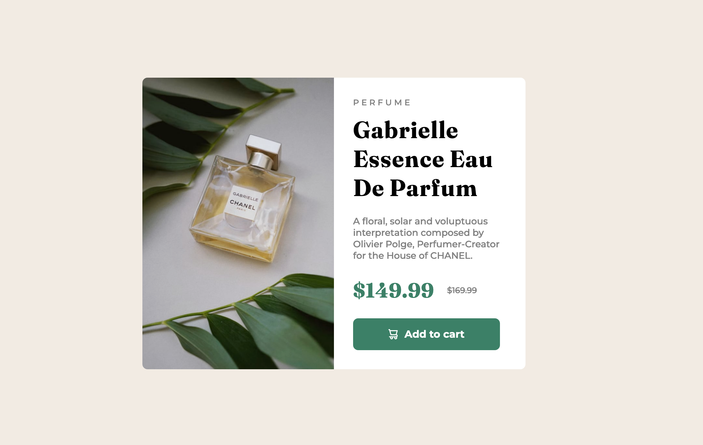
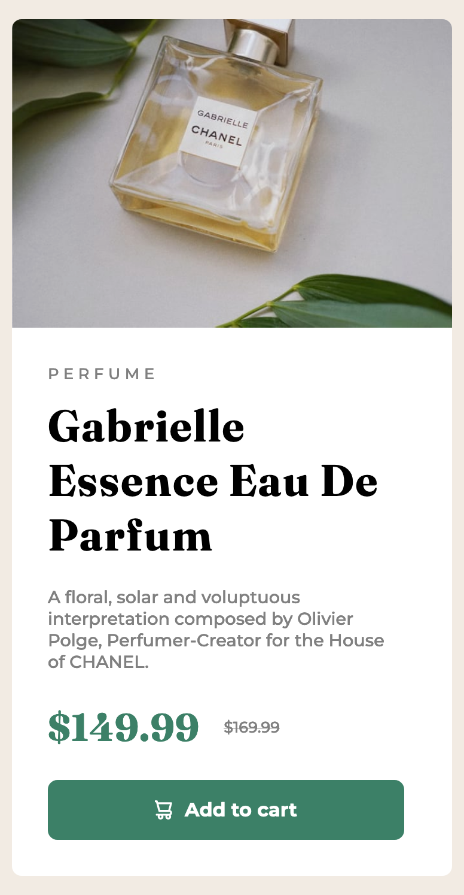

# Frontend Mentor - Product preview card component solution

This is a solution to the [Product preview card component challenge on Frontend Mentor](https://www.frontendmentor.io/challenges/product-preview-card-component-GO7UmttRfa). Frontend Mentor challenges help you improve your coding skills by building realistic projects.

## Table of contents

- [Overview](#overview)
  - [The challenge](#the-challenge)
  - [Screenshot](#screenshot)
  - [Links](#links)
- [My process](#my-process)
  - [Built with](#built-with)
  - [What I learned](#what-i-learned)
  - [Continued development](#continued-development)
  - [Useful resources](#useful-resources)
- [Author](#author)
- [Acknowledgments](#acknowledgments)

## Overview

My last newbie task on the frontend mentor platform, simple preview product with price and description.

### The challenge

Users should be able to:

- View the optimal layout depending on their device's screen size
- See hover and focus states for interactive elements

### Screenshot




### Links

- Solution URL: [Repo](https://github.com/Maksym-Paselsky/product-preview-card-component-main)
- Live Site URL: [Click to check the solution](https://maksym-paselsky.github.io/product-preview-card-component-main)

## My process

HTML markup
CSS positioning
Fonts, Colors
Margin, paddings
Mobile

### Built with

- Semantic HTML5 markup
- CSS custom properties
- Flexbox
- CSS Grid

### What I learned

Become more confident with flexbox and positioning, especialy in response design. Undertood how to use em's. Discover new tags picture and source.
Played a little with hsl(hue saturation brightness) really cool and easy to adjust.

```html
<picture>
  <source
    media="(max-width: 600px)"
    srcset="/images/image-product-mobile.jpg"
  />
  
</picture>
```

```css
.proud-of-this-css {
  margin-bottom: calc(25px - 1em); // becoming more familiar with calc
}
```

### Continued development

As I wrote before this is my last newbie level project, in case I found smth really cool and easy I will do it, but from now on I'm switching to more complex project
that requires grid system and more complex struture. Like hero page of a website and etc.

I think I will also switch from plain html css js to Next but not immediatly, I still need to cover the basics before going more "abstact".
